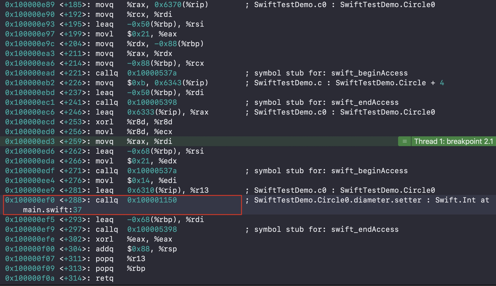

#### 一、 内存分析
 
#### 1. 结构体、枚举以及类的存储位置：

Swift 里面的类型分为两种：
<br>值类型（Value Types）：每个实例都保留了一分独有的数据拷贝，一般以结构体 （struct）、枚举（enum） 或者 元组（tuple）的形式出现。
<br>引用类型（Reference Type）：每个实例共享同一份数据来源，一般以类（class）的形式出现。

结构体、枚举的内存位置取决于结构体以及枚举变量定义的位置，若在函数中定义，则是在栈空间。若在函数外定义，则是在全局区（数据段）。若在类中定义，则跟随对象在堆空间。

类无论在哪定义，对象的内存都是在堆空间。

#### 2. 值类型的赋值操作：

在swift标准库中，为了提升性能，String、Array、Dictionary、Set采用了Copy On Write技术。

<br>什么是Copy-on-Write？

<br>当你有一个占用内存很大的一个值类型，并且不得不将它赋值给另一个变量或者当做函数的参数传递的时候，拷贝它的值是一个非常消耗内存的操作，因为你不得不拷贝它所有的东西放置在另一块内存中。
为了优化这个问题，Swift对于一些特定的值类型(集合类型：Array、Dictionary、Set)做了一些优化，在对于Array进行拷贝的时候，当传递的值进行改变的时候才会发生真正的拷贝。而对于String、Int等值类型，在赋值的时候就会发生拷贝。

#### 3. 内存空间

无论方法在全局还是函数内，都存放在代码段()


证明如下：


* 规律 （常用）

 内存地址格式为:0x4bdc(%rip)，一般是全局变量，全局区(数据段)
 <br>内存地址格式为:-0x78(%rbp)，一般是局部变量，栈空间
 <br>内存地址格式为:0x10(%rax)，一般是堆空间
 
 

#### 4. 闭包

表达式：

```swift
{ (参数列表) -> 返回类型 in
    // ... // 函数体代码
}
{}里面是闭包表达式，in把参数列表和返回值类型与函数体代码分隔开
```

* 如果闭包的参数和返回值都为空的话,”()->() in”就可以省略

```swift
{ 
    // ... // 函数体代码
}
```
* 调用闭包

```swift
{ 
    // ... // 代码
}()
```

#### 二、 属性
#### 1. swift中跟实例相关的属性可以分为两大类：
* 存储属性(Stored Property)
 1. 类似于成员变量这个概念
 2. 存储在实例的内存中
 3. 结构体、类可以定义存储属性 
 4. 枚举不可以定义存储属性
* 计算属性(Computed Property)
  1. 本质就是方法(函数)
  2. 不占用实例的内存
  3. 枚举、结构体、类都可以定义计算属性

```swift
struct Circle0 {
    //存储属性
    var radius: Int
    //计算属性:本质上是函数，不占结构体的内存
    var diameter: Int {
        //Computed property must have accessors specified
        set{
            radius = newValue/2
        }
        get{
            radius*2
        }
    }
}

var c0 = Circle0(radius: 3)
c0.radius = 11
c0.diameter = 20
```

给radius赋值：


给diameter赋值：


在创建类或结构体的实例时，必须为所有的存储属性设置一个合适的初始值

```swift
struct Point {
    var x: Int
    var y: Int
}
var point = Point(x: 0, y: 1)
```
可以在初始化器里为存储属性设置一个初始值

```swift
struct Point0 {
    var x: Int
    var y: Int
    init() {
        x = 0
        y = 0
    }
}
var point0 = Point0()
```
可以分配一个默认的属性值作为属性定义的一部分

```swift
struct Point1 {
    var x: Int = 0
    var y: Int = 0
}
var point1 = Point1()
```
#### 2. 延时存储属性

* 使用lazy可以定义一个延迟存储属性，在第一次用到属性的时候才会进行初始化

```swift
class Car {
    init() {
        print("Car init")
    }
    func run(){
        print("car run")
    }
}

class Person {
    
//    var car = Car()
    lazy var car = Car()
    init() {
        print("Person init")
    }
    func goOut(){
        car.run()
    }
}


var p = Person()
p.goOut()
```

* lazy属性必须是var，不能是let 因为let必须在实例的初始化方法完成之前就拥有值
* 如果多条线程同时第一次访问lazy属性 无法保证属性只被初始化1次

```swift
lazy var image: UIImage? = {
     let urlStr = "https://www.520it.com/xx.png"
     var img: UIImage?
     do{
         let url = URL(fileURLWithPath: urlStr)
         let data = try Data(contentsOf: url)
         img = UIImage(data: data)
         return img
     } catch {
         return nil
     }
    }()

```

相当于

```swift
 lazy var image: UIImage? = getImage("https://www.520it.com/xx.png")
    
 func getImage(_ urlStr: String) -> UIImage? {
        
        var img: UIImage?
        do{
            let url = URL(fileURLWithPath: urlStr)
            let data = try Data(contentsOf: url)
            img = UIImage(data: data)
            return img
        } catch {
            return nil
        }
    }

```
#### 3. 属性观察器

* 可以为非lazy的var存储属性设置属性观察器

